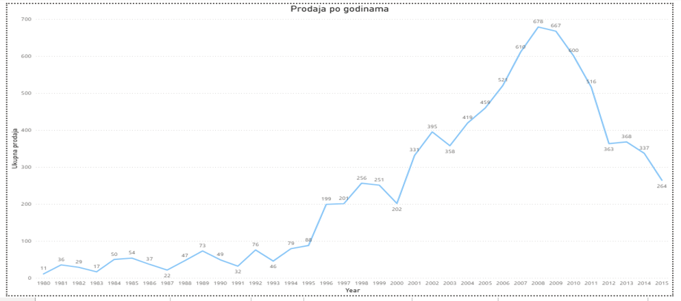

# Global video game sales analysis in Power BI

## Project overview
This project analyzes global video game sales using Power BI. The goal is to transform raw sales data into interactive visualizations to support data-driven business decisions. The dataset contains yearly sales per region and was preprocessed to ensure accurate analysis.

## Dashboard visualizations

### 1. Trend chart
  
Shows total sales per year from 1980 to 2015. Sales were initially low and unstable, then rose sharply around 1995, peaking in 2008 at 678 units, followed by a decline to 264 units by 2015. This demonstrates a typical product lifecycle: growth, expansion, peak, and decline.

### 2. Scatter plot – NA vs EU sales
  
Displays the relationship between sales in North America (X-axis) and Europe (Y-axis), with point size representing global sales. Games with high sales in NA often perform well in EU too, but some exceptions highlight regional differences, useful for marketing and strategy planning.

### 3. Bar chart – top 10 best-selling games
  
Horizontal bar chart showing the ten best-selling video games of all time. *Wii Sports* leads with 82.74 million copies, followed by *Grand Theft Auto V* (55.92M) and *Super Mario Bros.* (45.31M). Demonstrates the impact of popular franchises and widely available games.

### 4. Bar chart – total sales by publisher
  
Shows the ten most successful video game publishers by total sales. Nintendo leads with 1784.23 million copies, followed by Electronic Arts (1093.21M) and Activision (721.06M). Highlights the importance of strong franchises and consistent performance.

### 5. Pie chart – sales by region
  
Displays regional distribution of sales: North America 49%, Europe 27%, Japan 15%, and other regions 9%. Helps identify market concentration and plan regional strategies.

### 6. Card – top platform globally
  
Shows **PlayStation 2 (PS2)** as the most sold gaming platform worldwide. Its success is attributed to a large library of games, DVD support, and long lifespan.

### 7. Matrix – games by platform and genre
  
Shows the number of games released per platform and genre. Allows identification of popular platforms and dominant genres, highlighting industry trends and areas for innovation.

### 8. Dashboard overview
  
Full interactive dashboard combining all visualizations. Filters allow users to explore data by platform, publisher, genre, and region.

---
